# Google Cloud ADK AI Agents Tutorial

## Overview
This tutorial guides you through creating AI agents using Google Cloud's ADK (Agent Development Kit) with various tools and capabilities including currency exchange, web search, and Wikipedia integration.

## Prerequisites
- Google Cloud account with billing enabled
- Access to Google Cloud Shell

## Setup Instructions

### 1. Launch Cloud Shell
Navigate to [shell.cloud.google.com](https://shell.cloud.google.com) and authorize if prompted.

### 2. Set Project ID
```bash
gcloud config set project <your-project-id>
```

### 3. Enable Required APIs
```bash
gcloud services enable aiplatform.googleapis.com
```

### 4. Create Python Virtual Environment
```bash
# 1. Create project directory
mkdir ai-agents-adk
cd ai-agents-adk

# 2. Create and activate virtual environment
uv venv --python 3.12
source .venv/bin/activate

# 3. Install ADK package
uv pip install google-adk
```

### 5. Create an Agent
```bash
adk create personal_assistant
```
Follow the prompts:
- Choose model: Select `1` for gemini-2.5-flash
- Choose backend: Select `2` for Vertex AI
- Confirm Project ID: Press Enter if correct
- Confirm region: Press Enter for us-central1

### 6. Explore Agent Code
Open the `ai-agents-adk` folder in Cloud Shell Editor:
1. Click **File > Open Folder...**
2. Select the `ai-agents-adk` folder
3. Click **OK**

Key files:
- `agent.py` - Main agent configuration
- `__init__.py` - Package initialization
- `.env` - Environment variables (hidden by default)

To view hidden files:
- Click **View > Toggle Hidden Files**

Example `.env` content:
```bash
GOOGLE_GENAI_USE_VERTEXAI=1
GOOGLE_CLOUD_PROJECT=project-003dc6bc-7774-47c5-26b
GOOGLE_CLOUD_LOCATION=us-central1
```

### 7. Run the Agent in Terminal
```bash
adk run personal_assistant
```
Type `exit` to exit the chat session.

### 8. Troubleshooting

**Issue: "This API method requires billing to be enabled"**
- Verify Project ID in `.env` file
- Ensure billing account is linked
- Link to Google Cloud Platform Trial Billing Account if needed

**Issue: "Vertex AI API has not been used in project"**
```bash
gcloud services enable aiplatform.googleapis.com
```

### 9. Run the Agent in Web UI
```bash
adk web
```
Access options:
1. **Terminal**: Ctrl/Cmd + Click the link (http://127.0.0.1:8000)
2. **Web Preview**: 
   - Click Web Preview button
   - Select Change Port
   - Enter port 8000
   - Click Change and Preview

## Adding Custom Tools

### 10. Build Currency Exchange Tool

**a. Create custom_functions.py**
```bash
touch personal_assistant/custom_functions.py
```

**Folder structure:**
```
ai-agents-adk/
└── personal_assistant/
    ├── .env
    ├── __init__.py
    ├── agent.py
    └── custom_functions.py
```

**b. Add currency exchange function** (`custom_functions.py`):
```python
import requests

def get_fx_rate(base: str, target: str):
    """
    Fetches the current exchange rate between two currencies.

    Args:
        base: The base currency (e.g., "SGD").
        target: The target currency (e.g., "JPY").

    Returns:
        The exchange rate information as a json response,
        or None if the rate could not be fetched.
    """
    base_url = "https://hexarate.paikama.co/api/rates/latest"
    api_url = f"{base_url}/{base}?target={target}"

    response = requests.get(api_url)
    if response.status_code == 200:
        return response.json()
```

**c. Update agent.py:**
```python
from google.adk.agents import Agent
from google.adk.tools import FunctionTool
from .custom_functions import get_fx_rate

root_agent = Agent(
    model='gemini-2.5-flash',
    name='root_agent',
    description='A helpful assistant for user questions.',
    instruction='Answer user questions to the best of your knowledge',
    tools=[FunctionTool(get_fx_rate)]
)
```

**d. Test the agent:**
```bash
adk web
```
Ask: "What is the exchange rate from Singapore dollars to Japanese yen?"

### 11. Integrate Google Search Tool

**a. Create custom_agents.py:**
```bash
touch personal_assistant/custom_agents.py
```

**Folder structure:**
```
ai-agents-adk/
└── personal_assistant/
    ├── .env
    ├── __init__.py
    ├── agent.py
    ├── custom_functions.py
    └── custom_agents.py
```

**b. Add search agent** (`custom_agents.py`):
```python
from google.adk.agents import Agent
from google.adk.tools import google_search

google_search_agent = Agent(
    model='gemini-2.5-flash',
    name='google_search_agent',
    description='A search agent that uses google search to get latest information about current events, weather, or business hours.',
    instruction='Use google search to answer user questions about real-time, logistical information.',
    tools=[google_search],
)
```

**c. Update agent.py:**
```python
from google.adk.agents import Agent
from google.adk.tools import FunctionTool
from google.adk.tools.agent_tool import AgentTool
from .custom_functions import get_fx_rate
from .custom_agents import google_search_agent

root_agent = Agent(
    model='gemini-2.5-flash',
    name='root_agent',
    description='A helpful assistant for user questions.',
    tools=[
        FunctionTool(get_fx_rate), 
        AgentTool(agent=google_search_agent),
    ]
)
```

**d. Test with:**
Ask: "What is the weather forecast in Tokyo, Japan for next month?"

### 12. Add LangChain Wikipedia Tool

**a. Install dependencies:**
```bash
uv pip install langchain-community wikipedia
```

**b. Create third_party_tools.py:**
```bash
touch personal_assistant/third_party_tools.py
```

**Folder structure:**
```
ai-agents-adk/
└── personal_assistant/
    ├── .env
    ├── __init__.py
    ├── agent.py
    ├── custom_functions.py
    ├── custom_agents.py
    └── third_party_tools.py
```

**c. Add Wikipedia tool** (`third_party_tools.py`):
```python
from langchain_community.tools import WikipediaQueryRun
from langchain_community.utilities import WikipediaAPIWrapper

langchain_wikipedia_tool = WikipediaQueryRun(
    api_wrapper=WikipediaAPIWrapper(top_k_results=1, doc_content_chars_max=3000)
)

langchain_wikipedia_tool.description = (
    "Provides deep historical and cultural information on landmarks, concepts, and places."
    "Use this for 'tell me about' or 'what is the history of' type questions."
)
```

**d. Final agent.py:**
```python
from google.adk.agents import Agent
from google.adk.tools import FunctionTool
from google.adk.tools.agent_tool import AgentTool
from google.adk.tools.langchain_tool import LangchainTool
from .custom_functions import get_fx_rate
from .custom_agents import google_search_agent
from .third_party_tools import langchain_wikipedia_tool

root_agent = Agent(
    model='gemini-2.5-flash',
    name='root_agent',
    description='A helpful assistant for user questions.',
    tools=[
        FunctionTool(get_fx_rate), 
        AgentTool(agent=google_search_agent),
        LangchainTool(langchain_wikipedia_tool),
    ]
)
```

**e. Test with:**
Ask: "Tell me about the history of Kyoto"

**f. View event details:**
In the ADK web UI, click the **Events** tab and select the most recent `functionCall` event to see how the agent made decisions.

## GitHub Setup (Optional)

To publish code to GitHub from Cloud Shell:

```bash
# Configure Git
git config --global user.name "Your Name"
git config --global user.email "you@example.com"
git config --list

# Generate SSH key
ssh-keygen -t ed25519 -C "your_email@example.com"

# Start SSH agent
eval "$(ssh-agent -s)"
ssh-add ~/.ssh/id_ed25519

# Copy public key
cat ~/.ssh/id_ed25519.pub

# Set permissions
chmod 600 ~/.ssh/id_ed25519

# Test connection
ssh -T git@github.com
```

# Learning Objectives

## What You'll Learn

In this section, you'll learn:

- **How to create parent and sub-agent relationships**
- **How to write data to the session state from a tool**
- **How to read from the state using key templating** (e.g., `{my_key?}`)
- **How to use a SequentialAgent for step-by-step workflows**
- **How to use a LoopAgent to create iterative refinement cycles**
- **How to use a ParallelAgent to run independent tasks concurrently**

## 2. Multi-Agent Systems

In ADK, you organize agents in a **tree structure**. This hierarchy is key to controlling the conversation's flow, as it limits which agent can "pass" the conversation to which other agent. This makes the system's behavior more predictable and easier to debug.

### Benefits include:

- **Intuitive Design**: The structure is inspired by real-world teams, making it easier to reason about.
- **Controlled Flow**: The hierarchy gives you precise control over task delegation, which helps in debugging. For example, the tree structure ensures the correct report-writing agent is called, even if you have two with similar descriptions.

---

## Setup Instructions

### Clone the Repository

```bash
git clone --depth 1 https://github.com/GoogleCloudPlatform/devrel-demos.git devrel-demos-multiagent-lab
mv devrel-demos-multiagent-lab/ai-ml/build-multiagent-systems-with-adk/adk_multiagent_systems ~
cd ~/adk_multiagent_systems
```

### Open Cloud Editor

The explorer panel on the left will refresh. You should now see your complete project structure, with the `parent_and_subagents` and `workflow_agents` sub-directories, ready for the next steps.

### Activate Virtual Environment

```bash
uv venv
source .venv/bin/activate
```

### Install Dependencies

```bash
uv pip install -r requirements.txt
```

### Set Up Environment Variables

Get your active project ID:

```bash
gcloud projects list
gcloud config get-value project
```

Edit the environment file:

```bash
cloudshell edit .env
```

Paste the following into the `.env` file:

```bash
GOOGLE_GENAI_USE_VERTEXAI=TRUE
GOOGLE_CLOUD_PROJECT="[YOUR-PROJECT-ID]"
GOOGLE_CLOUD_LOCATION=global
MODEL="gemini-2.5-flash"
```

Copy `.env` to sub-agent directories:

```bash
cp .env parent_and_subagents/.env
cp .env workflow_agents/.env
```

> **Note**: You can see hidden files in Cloud Editor by toggling the "View Hidden Files" option.

---

## 7. Explore Transfers Between Parent, Sub-Agent, and Peer Agents

The conversation always starts with the `root_agent`. By default, a parent agent uses its sub-agents' description to decide when to transfer the conversation. You can also guide these transfers explicitly in the parent's instruction by using the sub-agents' name.

**Make `travel_brainstormer` and `attractions_planner` sub-agents** of the `root_agent` by adding the following line to the creation of the `root_agent`:

```python
sub_agents=[travel_brainstormer, attractions_planner]
```

**In the terminal, chat with your agent:**

```bash
cd ~/adk_multiagent_systems
adk run parent_and_subagents
```

At the `[user]:` prompt in the terminal, type:
```
hello
```

**Now let's be more explicit.** In `agent.py`, add the following to the `root_agent`'s instruction:

```python
"If they need help deciding, send them to 'travel_brainstormer'."
"If they know what country they'd like to visit, send them to the 'attractions_planner'."
```

**Again run:**

```bash
adk run parent_and_subagents
```

At the user prompt, type `exit` to end the session.

---

## 8. Use Session State to Store and Retrieve Information

Every ADK conversation has a **Session**, which includes a session state dictionary. This state is accessible to all agents, making it the perfect way to pass information between them or maintain data (like a list) throughout the conversation.

**Return to the file `adk_multiagent_systems/parent_and_subagents/agent.py`**

Paste the following function definition after the `# Tools` header:

```python
def save_attractions_to_state(
    tool_context: ToolContext,
    attractions: List[str]
) -> dict[str, str]:
    """Saves the list of attractions to state["attractions"].

    Args:
        attractions [str]: a list of strings to add to the list of attractions

    Returns:
        None
    """
    # Load existing attractions from state. If none exist, start an empty list
    existing_attractions = tool_context.state.get("attractions", [])

    # Update the 'attractions' key with a combo of old and new lists.
    # When the tool is run, ADK will create an event and make
    # corresponding updates in the session's state.
    tool_context.state["attractions"] = existing_attractions + attractions

    # A best practice for tools is to return a status message in a return dict
    return {"status": "success"}
```

**Add the tool to the `attractions_planner` agent** by adding the `tools` parameter:

```python
tools=[save_attractions_to_state]
```

**Add the following bullet points** to the `attractions_planner` agent's existing instruction:

```python
"- When they reply, use your tool to save their selected attraction and then provide more possible attractions."
"- If they ask to view the list, provide a bulleted list of { attractions? }"
```

**Launch the Agent Development Kit Web UI:**

```bash
adk web
```

**Test again:**
1. From the **Select an agent** dropdown on the left, choose `parent_and_subagents`
2. Start the conversation with: `hello`

---

## 9. Workflow Agents

This is perfect for automated, multi-step tasks like a "Plan and Execute" or "Draft and Revise" pipeline. ADK provides three built-in workflow agents to manage this:

1. **SequentialAgent**
2. **LoopAgent**
3. **ParallelAgent**

---

## 10. Build a Multi-Agent System with a SequentialAgent

**Workflow:**
1. A `root_agent` (greeter) will welcome the user and get the movie subject.
2. It will then transfer to a `SequentialAgent` named `film_concept_team`, which will:
   - Run a `researcher` agent to get facts from Wikipedia.
   - Run a `screenwriter` agent to use those facts to write a plot.
   - Run a `file_writer` agent to save the final plot to a file.

**In the Cloud Shell Editor, open `adk_multiagent_systems/workflow_agents/agent.py`**

Notice the `append_to_state` tool. This helper function lets agents append data to a list in the session state, which is how the researcher and screenwriter will pass their work.

**Try out the agent:**

```bash
cd ~/adk_multiagent_systems
adk web --reload_agents
```

---

## 11. Add a LoopAgent for Iterative Work

The `LoopAgent` is a workflow agent that runs its sub-agents in a sequence and then repeats, starting from the beginning. This "loop" continues until a condition is met, like reaching a `max_iterations` count or a sub-agent calling the built-in `exit_loop` tool.

**To make these changes:**

1. **Add the import for `exit_loop`** (near the other google.adk imports):

```python
from google.adk.tools import exit_loop
```

2. **Add the new `critic` agent.** This agent will review the plot. If it's good, it calls `exit_loop`. If not, it adds feedback to the state for the next loop.

Paste the following agent definition under the `# Agents` section:

```python
critic = Agent(
    name="critic",
    model=model_name,
    description="Reviews the outline so that it can be improved.",
    instruction="""
    INSTRUCTIONS:
    Consider these questions about the PLOT_OUTLINE:
    - Does it meet a satisfying three-act cinematic structure?
    - Do the characters' struggles seem engaging?
    - Does it feel grounded in a real time period in history?
    - Does it sufficiently incorporate historical details from the RESEARCH?

    If the PLOT_OUTLINE does a good job with these questions, exit the writing loop with your 'exit_loop' tool.
    If significant improvements can be made, use the 'append_to_state' tool to add your feedback to the field 'CRITICAL_FEEDBACK'.
    Explain your decision and briefly summarize the feedback you have provided.

    PLOT_OUTLINE:
    { PLOT_OUTLINE? }

    RESEARCH:
    { research? }
    """,
    before_model_callback=log_query_to_model,
    after_model_callback=log_model_response,
    tools=[append_to_state, exit_loop]
)
```

3. **Create the `writers_room` LoopAgent.** This will contain the three agents that will work in the loop.

Paste the following code above the `film_concept_team` agent definition:

```python
writers_room = LoopAgent(
    name="writers_room",
    description="Iterates through research and writing to improve a movie plot outline.",
    sub_agents=[
        researcher,
        screenwriter,
        critic
    ],
    max_iterations=5,
)
```

4. **Update the `film_concept_team` SequentialAgent** to use the new `writers_room` loop. Replace the `researcher` and `screenwriter` with the single `writers_room` agent.

Replace your existing `film_concept_team` definition with this:

```python
film_concept_team = SequentialAgent(
    name="film_concept_team",
    description="Write a film plot outline and save it as a text file.",
    sub_agents=[
        writers_room,
        file_writer
    ],
)
```

5. **Test the updated agent:**
   - Return to the ADK Dev UI tab and click **+ New Session** in the upper right
   - Begin a new conversation with: `hello`
   - When prompted, give the agent a broader topic this time
   - When the loop completes, the agent will write the file
   - Review the generated file in the `adk_multiagent_systems/movie_pitches` directory
   - Inspect the event graph in the Dev UI to see the loop structure

---

## 12. Use a ParallelAgent for "Fan Out and Gather"

The `ParallelAgent` is a workflow agent that executes all its sub-agents at the same time (concurrently). This is valuable for tasks that can be divided into independent sub-tasks, like running two different research jobs.

**You will use a ParallelAgent to create a "preproduction team"** that works in parallel. One agent will research box office potential while another agent simultaneously brainstorms casting ideas. This is often called a **"fan out and gather" pattern**: the ParallelAgent "fans out" the work, and a later agent (our file_writer) "gathers" the results.

**Your final agent flow will be:**
1. The `greeter` (root) starts the chat
2. It transfers to the `film_concept_team` (SequentialAgent), which runs:
   - The `writers_room` (LoopAgent) to create the plot
   - The new `preproduction_team` (ParallelAgent) to research box office and casting at the same time
   - The `file_writer` to gather all the results and save the file

**In `adk_multiagent_systems/workflow_agents/agent.py`, paste the new ParallelAgent and its sub-agents** under the `# Agents` header:

```python
box_office_researcher = Agent(
    name="box_office_researcher",
    model=model_name,
    description="Considers the box office potential of this film",
    instruction="""
    PLOT_OUTLINE:
    { PLOT_OUTLINE? }

    INSTRUCTIONS:
    Write a report on the box office potential of a movie like that described in PLOT_OUTLINE based on the reported box office performance of other recent films.
    """,
    output_key="box_office_report"
)

casting_agent = Agent(
    name="casting_agent",
    model=model_name,
    description="Generates casting ideas for this film",
    instruction="""
    PLOT_OUTLINE:
    { PLOT_OUTLINE? }

    INSTRUCTIONS:
    Generate ideas for casting for the characters described in PLOT_OUTLINE
    by suggesting actors who have received positive feedback from critics and/or
    fans when they have played similar roles.
    """,
    output_key="casting_report"
)

preproduction_team = ParallelAgent(
    name="preproduction_team",
    sub_agents=[
        box_office_researcher,
        casting_agent
    ]
)
```

**Update the `film_concept_team` SequentialAgent's `sub_agents` list** to include the new `preproduction_team` (between `writers_room` and `file_writer`):

Replace your existing `film_concept_team` definition with this:

```python
film_concept_team = SequentialAgent(
    name="film_concept_team",
    description="Write a film plot outline and save it as a text file.",
    sub_agents=[
        writers_room,
        preproduction_team,
        file_writer
    ],
)
```

**Update the `file_writer` agent's instruction** so it "gathers" the new reports from the state and adds them to the file:

Replace the instruction string for the `file_writer` with this:

```python
instruction="""
INSTRUCTIONS:
- Create a marketable, contemporary movie title suggestion for the movie described in the PLOT_OUTLINE.
If a title has been suggested in PLOT_OUTLINE, you can use it, or replace it with a better one.
- Use your 'write_file' tool to create a new txt file with the following arguments:
- for a filename, use the movie title
- Write to the 'movie_pitches' directory.
- For the 'content' to write, include:
- The PLOT_OUTLINE
- The BOX_OFFICE_REPORT
- The CASTING_REPORT

PLOT_OUTLINE:
{ PLOT_OUTLINE? }

BOX_OFFICE_REPORT:
{ box_office_report? }

CASTING_REPORT:
{ casting_report? }
""",
```

---

## 13. Custom Workflow Agents

When the pre-defined workflow agents of `SequentialAgent`, `LoopAgent`, and `ParallelAgent` are insufficient for your needs, `CustomAgent` provides the flexibility to implement new workflow logic.

---

## Cleanup

**Remove all resources used in the ADK project from GCP:**

```bash
gcloud services disable \
    aiplatform.googleapis.com \
    geminicloudassist.googleapis.com \
    cloudaicompanion.googleapis.com \
    cloudasset.googleapis.com \
    recommender.googleapis.com \
    appoptimize.googleapis.com \
    --force
```


### Remove Local Files Only
```bash
cd ~
rm -rf ai-agents-adk
gcloud services disable aiplatform.googleapis.com
```

### Disable Vertex AI API
```bash
gcloud services disable aiplatform.googleapis.com
```

### Shut Down Entire Google Cloud Project
Visit: https://cloud.google.com/resource-manager/docs/creating-managing-projects#shut_down_a_project

## Next Steps

### 13. Build Advanced Multi-Agent Systems
- **Travel Planning Agent**: Transfer conversations between specialized agents
- **Movie Pitch Generator**: Create automated writer's room with researcher, screenwriter, and critic agents
- **Workflow Agents**: Control flow automatically without user input at every step
- **Session State**: Pass information between agents

## Notes
- ADK supports three tool categories:
  1. **Function Tools**: Custom tools for unique requirements
  2. **Built-in Tools**: Ready-to-use tools (Google Search, Code Execution)
  3. **Third-party Tools**: External libraries (Serper, LangChain, CrewAI)
- Use `AgentTool` wrapper to make agents act as tools
- Use `LangchainTool` wrapper to integrate LangChain tools
- The `root_agent` acts as an orchestrator to delegate tasks to specialized tools/agents

## Screenshots


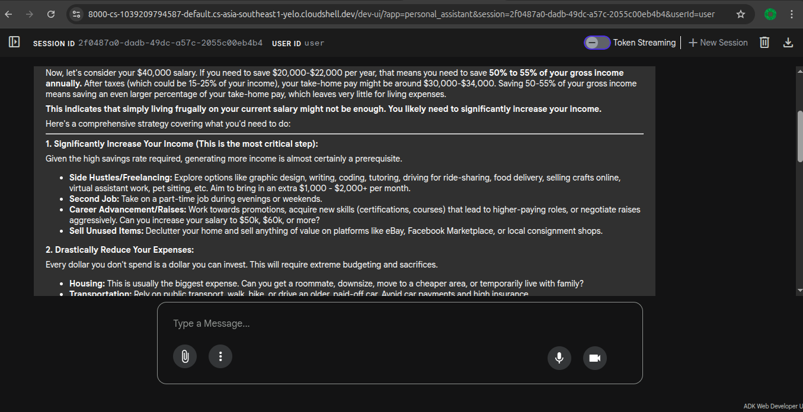

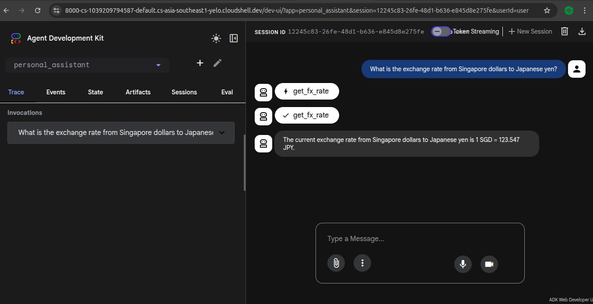

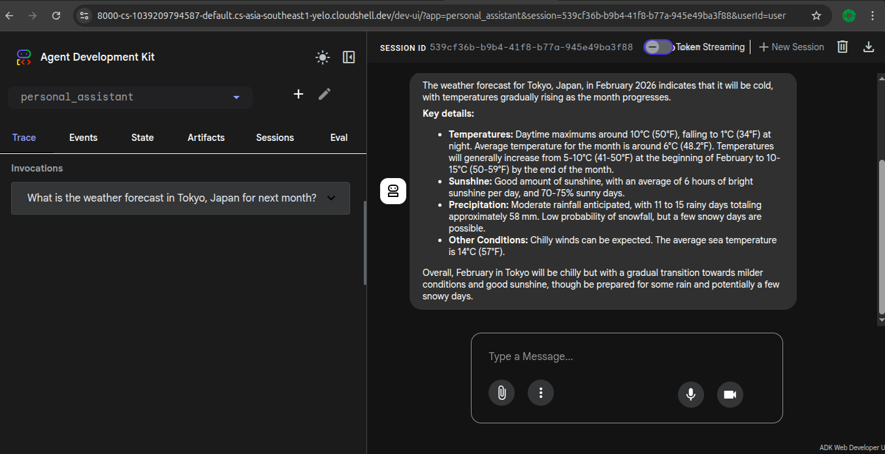


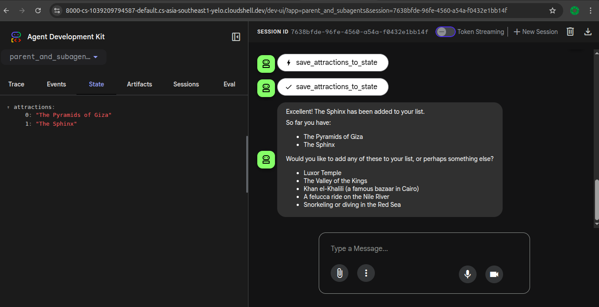

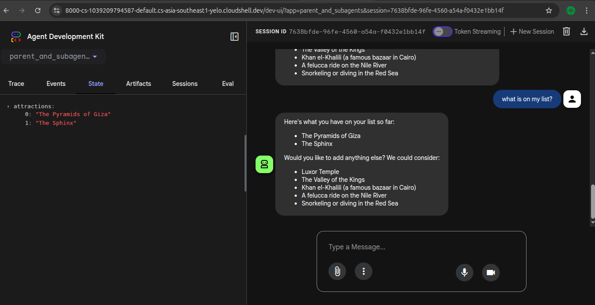


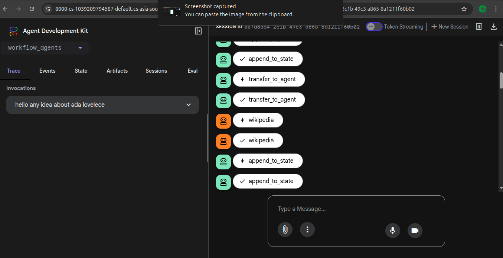

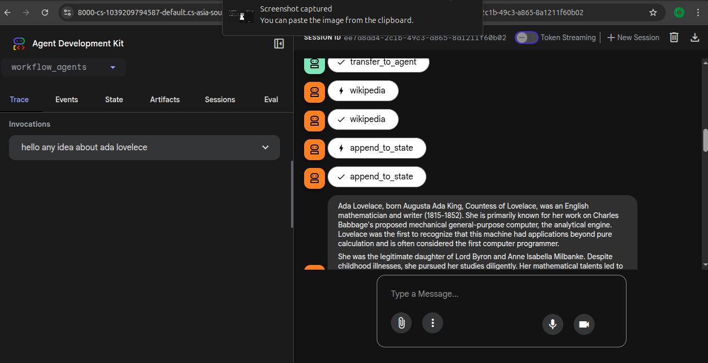

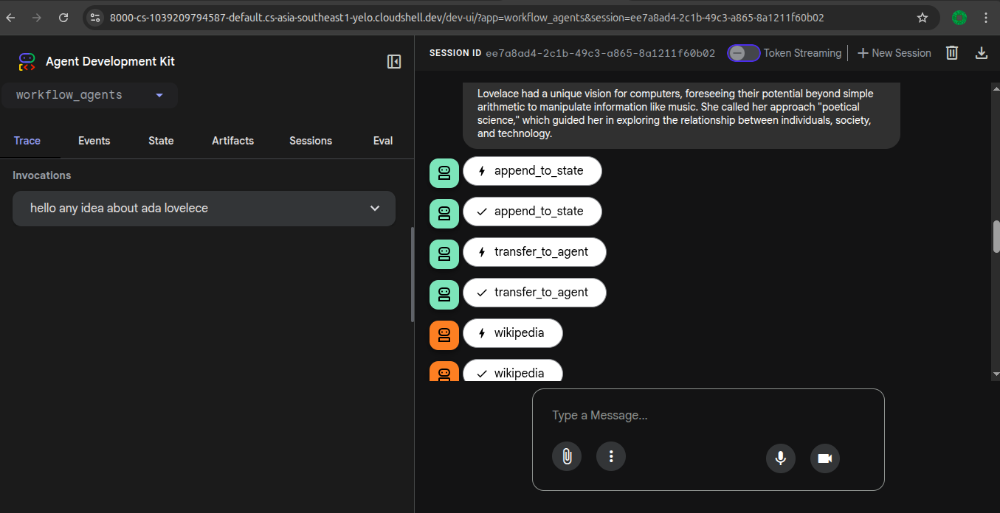


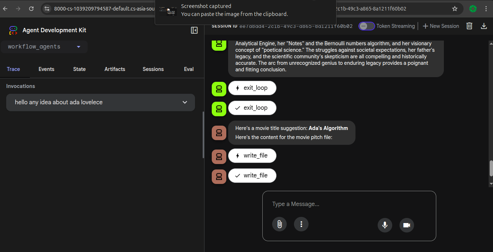

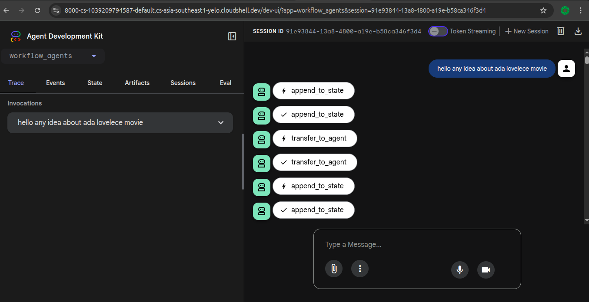


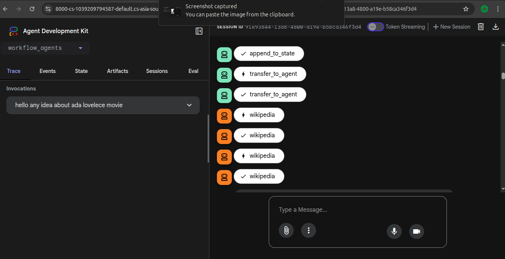

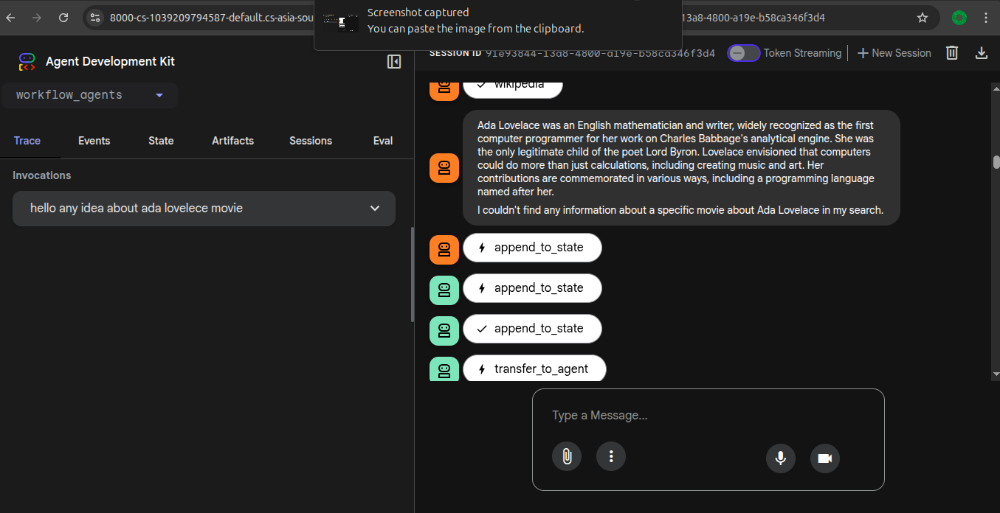

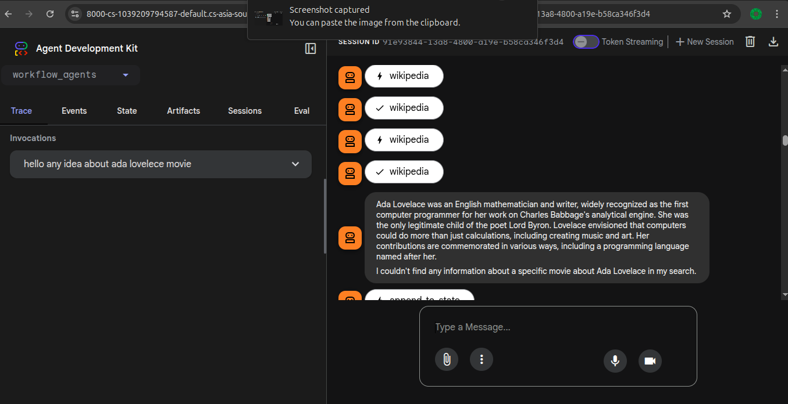

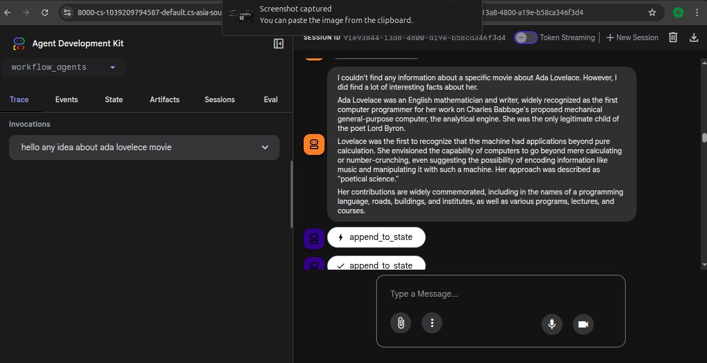

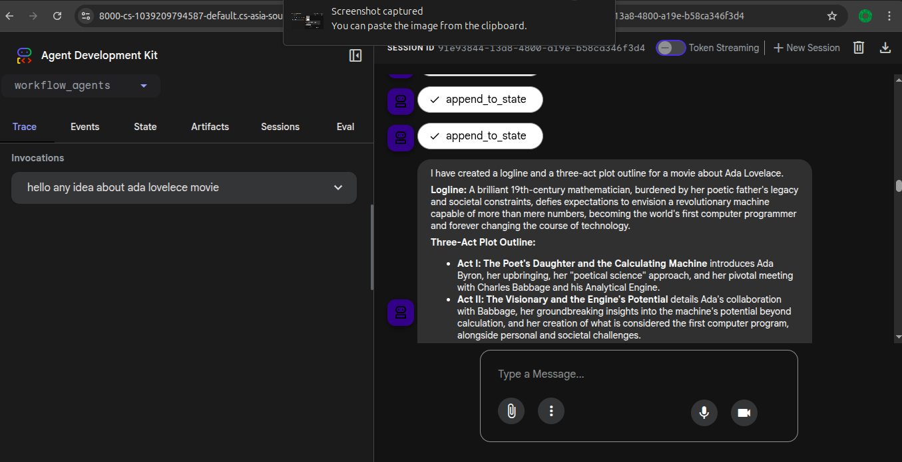


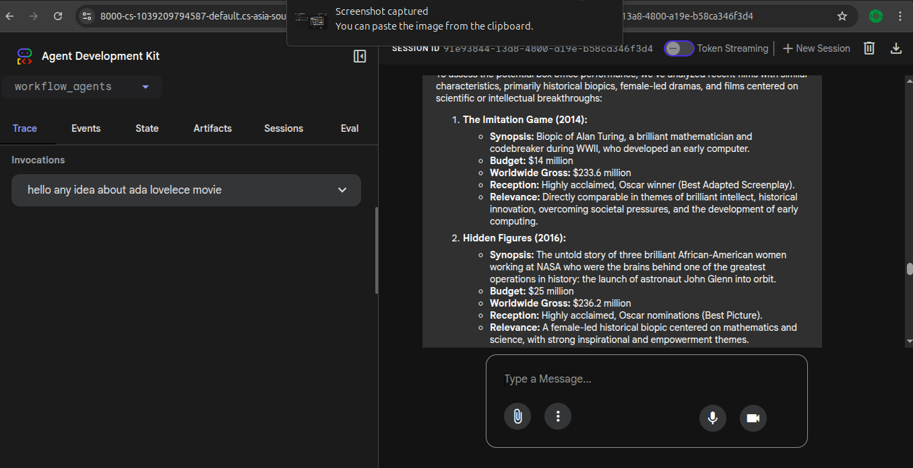


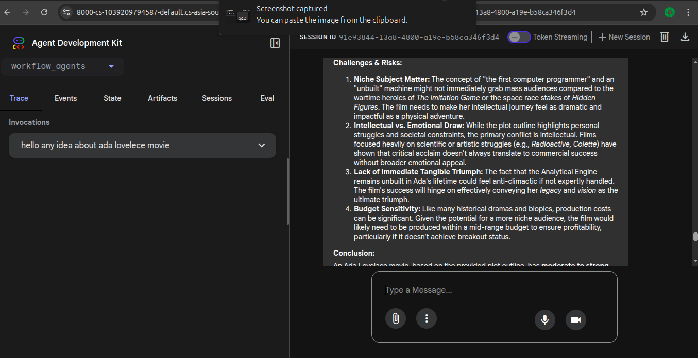


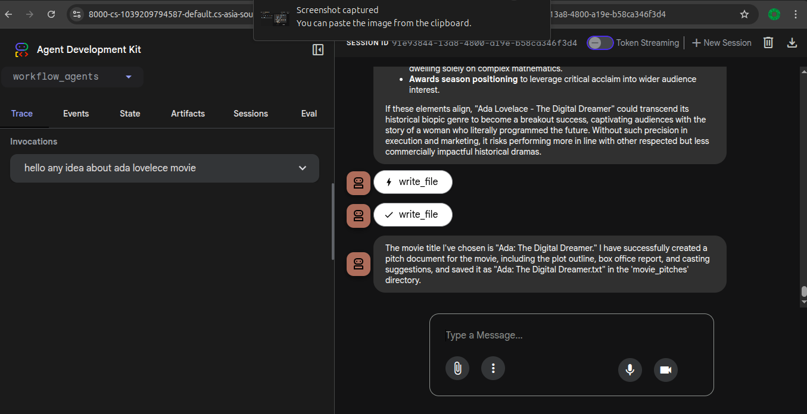
